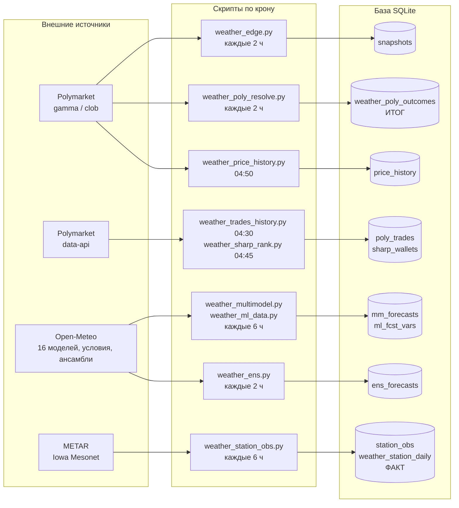
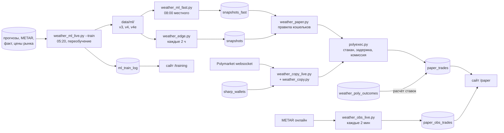
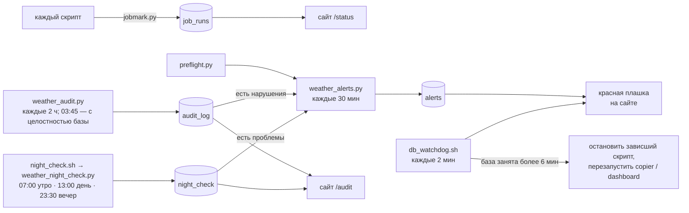

# Архитектура weather-lab

Общая картина: откуда берутся данные, какой скрипт что пишет в базу, как из этого получаются
ставки кошельков и страницы сайта. Правила работы — `CLAUDE.md`, цели — `docs/PRD.md`,
внешний вид сайта — `docs/DESIGN_SYSTEM.md`.

## 1. Схема

### Сбор данных



### Модель и ставки



### Контроль



## 2. Контейнеры (`docker-compose.yml`)

Список скриптов крона с подписями, расписанием и допустимым опозданием — `app/jobs_info.py`
(его читают `/status` и `weather_alerts.py`). **Меняешь крон — поправь `jobs_info.py`.**
Каждый запуск идёт через `run_job.sh` → `job_wrap.py`: предел времени, запись в `job_log`,
подсчёт запросов к Open-Meteo.

| Контейнер | Режим | Что делает |
|---|---|---|
| `collector` | по крону, `docker compose run --rm collector <скрипт>` | все скрипты `app/*.py`; вход через `app/run_job.sh` (предел времени `JOB_TIMEOUT`, по умолчанию 40 мин) |
| `weather-lab-copier` | постоянно | `weather_copy_live.py` — слушает сделки Polymarket (websocket) и повторяет покупки сильных трейдеров за секунды |
| `weather-lab-dashboard` | постоянно, порт 8093 | `dashboard.py` (FastAPI + Jinja2), снаружи — туннель Cloudflare |

Общие папки: `./app` → `/app`, `./data` → `/data`. Часовой пояс контейнеров — `Europe/Chisinau`.

## 3. Внешние источники

| Источник | Адрес | Зачем | Лимиты |
|---|---|---|---|
| Polymarket Gamma | `gamma-api.polymarket.com` | список маркетов, варианты, итоги | — |
| Polymarket CLOB | `clob.polymarket.com` | живой стакан (исполнение ставок), история цен | — |
| Polymarket Data API | `data-api.polymarket.com` | настоящие сделки (хранит ~30 дней) | — |
| Polymarket WS | `wss://ws-live-data.polymarket.com` | сделки в реальном времени (copier) | — |
| Open-Meteo | `api.`, `ensemble-api.`, `previous-runs-api.`, `historical-forecast-api.open-meteo.com` | 16 погодных моделей, ансамбли, история прогнозов | ~10 тыс. вызовов/сутки, крон тратит 5-6 тыс. |
| Iowa Mesonet | `mesonet.agron.iastate.edu` | METAR — факт температуры (как у Polymarket) | — |
| aviationweather.gov, NOAA tgftp | METAR онлайн | кошелёк `obs` | — |

Личные данные во внешние API не передаются.

## 4. Таблицы базы

`data/db/polymarket_lab.sqlite3`, ~6 ГБ, режим WAL.

### Сырые данные

| Таблица | Кто пишет | Что внутри |
|---|---|---|
| `snapshots` | `weather_edge.py`, `weather_multimodel.py` | снимок каждые 2 ч: цены всех вариантов + шансы всех моделей (колонка на модель) |
| `snapshots_fast` | `weather_ml_fast.py` | то же для обучаемых моделей, ровно в 08:00 местного |
| `mm_forecasts` | `weather_multimodel.py` | прогнозы 16 погодных моделей |
| `ml_fcst_vars` | `weather_ml_data.py` | прогнозные условия (облака, ветер и т. п.) |
| `ens_forecasts` | `weather_ens.py` | ансамбли ECMWF/GEFS/ICON + с 28.09 AIFS/UKMO/GEM (212 вариантов), копятся для проверки (сверка ~28.10) |
| `station_obs` | `weather_station_obs.py` | METAR по часам |
| `weather_station_daily` | `weather_station_obs.py` | **факт**: максимум за день по станции |
| `weather_poly_outcomes` | `weather_poly_resolve.py` (+ `weather_obs_live.py`, `weather_price_history.py`) | **итог** Polymarket: какой вариант выиграл |
| `poly_trades`, `poly_trades_days`, `poly_trade_wallets`, `poly_market_final` | `weather_trades_history.py` | настоящие сделки — по ним проверяется преимущество |
| `price_history`, `price_history_days` | `weather_price_history.py` | история цен (последние сделки, могут быть протухшими) |
| `sharp_wallets` | `weather_sharp_rank.py` | 30 сильных трейдеров для кошелька `copy` |

### Модели и результаты

| Таблица | Кто пишет | Что внутри |
|---|---|---|
| `ml_train_log` | `weather_ml_live.py --train`, `weather_ml_report.py` | ежедневное переобучение, отчёт, экзамен → `/training` |
| `ml_skill` | `weather_ml_skill.py` | «насколько модель права» |
| `ml_preds_wf`, `ml_preds_q`, `ml_preds_var_*` | исследования | прогнозы на истории (проверка «обучил на прошлом — проверил на будущем») |
| `paper_trades` | `weather_paper.py`, `weather_copy*.py` | ставки всех кошельков: покупка, пропуск с причиной, итог |
| `paper_obs_trades`, `metar_seen*` | `weather_obs_live.py` | кошельки `obs` и `obs_fmi` (колонка `wallet`) |

### Служебные

| Таблица | Кто пишет | Что внутри |
|---|---|---|
| `job_runs` | `jobmark.py` (из скриптов и обёртки) | последний успешный запуск |
| `job_log` | `job_wrap.py` (обёртка каждого запуска крона) | каждый запуск: код выхода, длительность, запросы к Open-Meteo; хранится 14 дней → `/status` |
| `alerts` | `weather_alerts.py` | активные тревоги → красная плашка на сайте |
| `night_check` | `weather_night_check.py` (через `night_check.sh`: 07:00 morning «ночь прошла?», 13:00 midday «утренние решения приняты?», 23:30 evening «ночь пройдёт?») | проверки в течение дня, колонка `mode`: код, ставки, крон, база, сервисы, модели к обучению — ok / внимание / проблема с подсказкой «что делать»; 60 дней → `/audit` |
| `notes` (отдельный файл `data/db/notes.sqlite3`) | `notes.py`, сайт `/notes` | заметки с датой «что проверить / запустить»; несделанные на сегодня — счётчик в панели и строка «Заметки» в утренней/дневной проверке, вечером — «на завтра» |
| `audit_log` | `weather_audit.py` | результат полной проверки: каждая ставка против правил и итогов, модели, данные, крон, целостность базы; 30 дней → `/audit` |

Устаревшие, больше не пополняются: `weather_outcomes` (факт по Open-Meteo — оказался неверным),
`afd_signals` (разборы метеорологов), `ml_neighbors` (соседние станции).

## 5. Факт и итог

- 48 городов (`weather_cities.py`), маркеты «Highest temperature in X», резолв по METAR.
- **Факт** — `weather_station_daily` (METAR, Iowa Mesonet); **итог** — `weather_poly_outcomes`.
  Совпадают в ~98%; ставки рассчитываются по итогу. 5-минутные замеры США не засчитываются.
- Проверять преимущество — по настоящим сделкам (`poly_trades`), не по `price_history`
  (там последние сделки, могут быть протухшими).
- `/book` уже содержит зеркальные заявки парного токена — стаканы не объединять.

## 6. Модель

- **v3 (главная, `ml3`)**: LightGBM, одна на 48 городов, квантильная регрессия (13 уровней) — поправка
  к среднему 16 погодных моделей. Признаки на 08:00 местного: прогнозы и их разброс, прогнозные
  условия, утренние METAR, вчерашняя ошибка, сезон, город, **мнение рынка**. История с 2025-06-01,
  цены рынка тоже (Шэньчжэнь/Париж/Сеул до смены источника — без них, `MKT_UNRELIABLE_BEFORE`).
- **Смесь 35% модели + 65% рынка** лучше и модели, и рынка: модель честна, но самоуверенна в ставках
  (выбор максимального спора с рынком), смесь это лечит.
- **v4** = v3 с 31 листом (`V4_EXTRA`); **v4e** = v4, среднее 3 обучений (зёрна `V4E_SEEDS` 11/22/33).
  v1 (`ml`, одно число), v2 (`ml2`, без рынка) — для сравнения.
- Код: `weather_ml.py` (`row_for` — **одна** функция признаков для обучения и живого прогноза),
  `weather_ml_q.py` (квантильная регрессия), `weather_ml_live.py` (обучение и живой прогноз).
- Файлы моделей — `data/ml/`: `q_mkt` (v3), `q_mkt31` (v4), `q_mkt31_s11/_s22/_s33` (v4e), `q` (v2), `model.txt` (v1).
- Каждую ночь (05:20) — переобучение на всей истории, отчёт и экзамен в `ml_train_log`.
- Живой прогноз считается в `weather_ml_fast.py` (08:00 местного) и `weather_edge.py` (каждые 2 ч) и пишется
  колонкой в снимок.

## 7. Кошельки и ставки

$100 на кошелёк (`copy` и `ml` — $300, `START_BY_WALLET`), ставка $2, минимум 5 долей.

1. `weather_paper.py` берёт самый ранний снимок дня по городу (быстрый 08:00 или обычный).
2. Раз в день на город — вариант с максимальным перевесом над ценой, если перевес ≥ порога и
   цена 3-95¢; цена покупки не выше «шанс − порог».
3. `polyexec.py` имитирует покупку: живой стакан → пауза 2 с → стакан ещё раз, комиссия
   `доли × 0.05 × p × (1−p)` с того, кто забирает заявку. Нет исполнения — `nofill`, пропуск — `skip`
   (с причиной). Файл `data/STOP` останавливает новые ставки.
4. После итога маркета ставка рассчитывается, кошелёк пересчитывается.

| Кошелёк | Логика |
|---|---|
| **`ml3`** | главная v3, порог 10 п.п. |
| `ml4` / `ml4_cal` | v4; и смесь v4 с рынком, порог 3 п.п. |
| `ml4e` / `ml4e_cal` | v4e; и её смесь, порог 3 п.п. |
| `ml3_cal` | смесь v3 с рынком, порог 3 п.п. |
| `ml3_cal_k` | смесь, ставка по перевесу (Келли ×0.25, $0.5-10) |
| `no_cheap` | «нет» на вариант за 5-15¢, который смесь считает переоценённым; «нет» ≤ цена + 1¢ (`NO_BAND`); с 28.09 |
| `ml3_cal15` | как `ml3_cal`, но не дешевле 15¢ (`MIN_PRICE_BY_WALLET`; переоценка «лотерейных билетов»); с 28.09 |
| `ens` | 6 ансамблей (`ens_forecasts.members_json`, 212 вариантов, поправка города) + смесь 35/65 с рынком, порог 3 п.п.; с 28.09, проверка 12.10 / 28.10 |
| `ml3_no` | «против»: покупка «нет» на переоценённый вариант |
| `ml3_mk` | сигнал ml3 своей заявкой (без комиссии, до 12:00) |
| `copy` | повтор покупок 30 сильных трейдеров, только накануне дня маркета, за секунды |
| `ml`, `ml2`, `ml_shift` | старые версии (ml_shift — v1, если центр ≠ рынку на ≥0.5°C) |
| `main`, `emos`, `mm`, `*_mk` | старые формулы и их «своя заявка» |
| `obs` | против вариантов, которые станция уже исключила |
| `obs_fmi` | то же по 10-минутным замерам FMI, только Хельсинки (с 27.09, проверка вживую) |

Подписи и группы на сайте — `WALLET_INFO` в `dashboard.py`; полная логика («Как работает этот
кошелёк») — `app/wallet_docs.py`, preflight проверяет, что описание есть у каждого.

## 8. Надёжность

| Механизм | Где | Что защищает |
|---|---|---|
| WAL | база | чтение сайтом не мешает записи |
| `item_guard` | `jobmark.py`, циклы по городам / трейдерам / дням во всех скриптах крона | ошибка на одном элементе не роняет запуск: элемент пропускается (запись откатывается), остальные идут дальше; число пропусков — `job_log.item_errors`, на /status «с пропусками» |
| `JOB_TIMEOUT` + `job_wrap.py` | `app/run_job.sh` | зависший скрипт убивается (крупные задачи: `-e JOB_TIMEOUT=10800` и т. п. в кроне) |
| `db_watchdog.sh` | крон */2 | база занята >6 мин → останавливает зависшие скрипты, при необходимости перезапускает copier/dashboard, пишет `data/ALERT_DB_LOCKED` |
| `preflight.py` / `./check.sh` | каждые 30 мин / после изменений | сборка скриптов, колонки, прогон всех кошельков в памяти, страницы |
| `weather_alerts.py` | крон */30 | сбои крона, упавшие проверки, потеря >$50/сутки |
| `backup_db.sh` | **в крон не добавлен** | ночная копия на другой диск (HDD personal_data), 7 штук; включение — решение Alex |

Исследования — только на копии `data/research/research.sqlite3`, иначе крон ловит «database is locked».

## 9. Сайт (`dashboard.py`)

| Страница | Что показывает | Основные таблицы |
|---|---|---|
| `/paper` | все кошельки → `?w=<кошелёк>`: счёт, открытые ставки сценариями, история | `paper_trades`, `ml_skill`, `job_runs`, `alerts` |
| `/` , `/city/<город>` | погода по городам: цена рынка против моделей | `snapshots` |
| `/training` | ночное обучение, отчёт, экзамен | `ml_train_log` |
| `/audit` | автоматическая проверка: нарушения правил кошельков, модели, данные, база, крон; история последних проверок | `audit_log` |
| `/bets` | все ставки всех кошельков: ждут итога (по времени закрытия) и закрытые за 7 дней, движение денег за 14 дней, фильтр по кошельку | `paper_trades`, `paper_obs_trades` |
| `/notes` | заметки с датой: добавить, «Сделано», удалить (сайт пишет только в `notes.sqlite3`, рабочую базу — только читает) | `notes.sqlite3` |
| `/events` | лента событий за 3 дня: обучение, загрузка данных, итоги маркетов, ставки сводкой по часам, тревоги, ошибки | `job_log`, `ml_train_log`, `weather_poly_outcomes`, ставки, `alerts` |
| `/status` | здоровье системы: скрипты крона (успех, ошибки, опоздания), тревоги, база и диск, стоп ставок, расход Open-Meteo | `job_runs`, `job_log`, `alerts`, логи `data/logs/` |

## 10. Папки

```
weather-lab/
├── app/                   скрипты, сайт, шаблоны (app/templates)
├── data/
│   ├── db/                рабочая база
│   ├── research/          копия базы для исследований
│   ├── ml/                файлы моделей
│   ├── logs/              логи крона
│   └── STOP               (если есть) — стоп новых ставок
├── docs/                  PRD, ARCHITECTURE, DESIGN_SYSTEM, архивы CLAUDE.md
├── check.sh               обязательная проверка после изменений
├── db_watchdog.sh         сторож базы
└── backup_db.sh           резервная копия (не в кроне)
```

Скрипты `weather_study_*.py`, `*_backtest.py`, `weather_ml_variants.py`, `weather_ml_realfill.py` и т. п. —
разовые исследования, по крону не запускаются.
