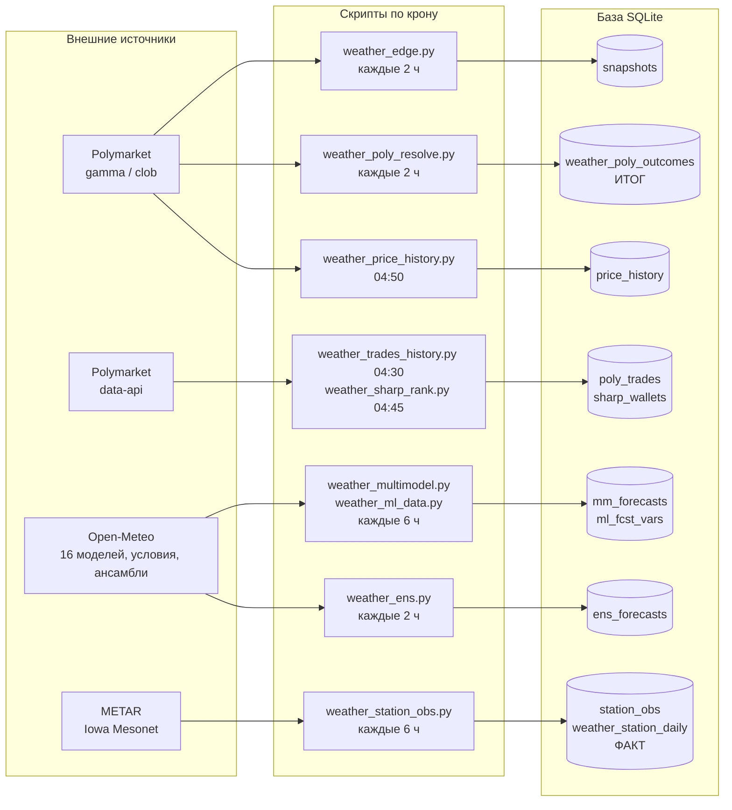
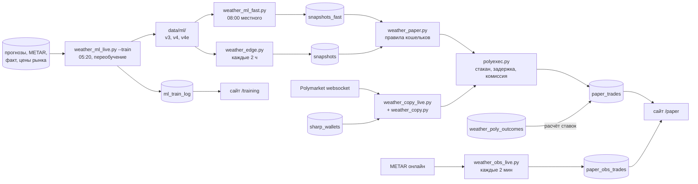
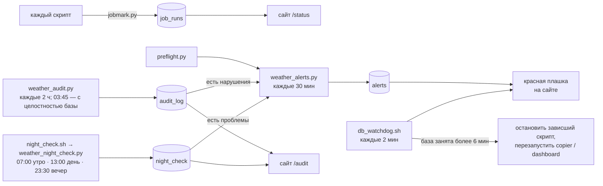

# Архитектура weather-lab

Общая картина: откуда берутся данные, какой скрипт что пишет в базу, как из этого получаются
ставки кошельков и страницы сайта. Правила работы — `CLAUDE.md`, цели — `docs/PRD.md`,
внешний вид сайта — `docs/DESIGN_SYSTEM.md`.

## 1. Схема

### Сбор данных



### Модель и ставки



### Контроль



## 2. Контейнеры (`docker-compose.yml`)

Список скриптов крона с подписями, расписанием и допустимым опозданием — `app/jobs_info.py`
(его читают `/status` и `weather_alerts.py`). **Меняешь крон — поправь `jobs_info.py`.**
Каждый запуск идёт через `run_job.sh` → `job_wrap.py`: предел времени, запись в `job_log`,
подсчёт запросов к Open-Meteo.

| Контейнер | Режим | Что делает |
|---|---|---|
| `collector` | по крону, `docker compose run --rm collector <скрипт>` | все скрипты `app/*.py`; вход через `app/run_job.sh` (предел времени `JOB_TIMEOUT`, по умолчанию 40 мин) |
| `weather-lab-copier` | постоянно | `weather_copy_live.py` — слушает сделки Polymarket (websocket) и повторяет покупки сильных трейдеров за секунды |
| `weather-lab-dashboard` | постоянно, порт 8093 | `dashboard.py` (FastAPI + Jinja2), снаружи — туннель Cloudflare |

Общие папки: `./app` → `/app`, `./data` → `/data`. Часовой пояс контейнеров — `Europe/Chisinau`.

## 3. Внешние источники

| Источник | Адрес | Зачем | Лимиты |
|---|---|---|---|
| Polymarket Gamma | `gamma-api.polymarket.com` | список маркетов, варианты, итоги | — |
| Polymarket CLOB | `clob.polymarket.com` | живой стакан (исполнение ставок), история цен | — |
| Polymarket Data API | `data-api.polymarket.com` | настоящие сделки (хранит ~30 дней) | — |
| Polymarket WS | `wss://ws-live-data.polymarket.com` | сделки в реальном времени (copier) | — |
| Open-Meteo | `api.`, `ensemble-api.`, `previous-runs-api.`, `historical-forecast-api.open-meteo.com` | 16 погодных моделей, ансамбли, история прогнозов | ~10 тыс. вызовов/сутки, крон тратит 5-6 тыс. |
| Iowa Mesonet | `mesonet.agron.iastate.edu` | METAR — факт температуры (как у Polymarket) | — |
| aviationweather.gov, NOAA tgftp | METAR онлайн | кошелёк `obs` | — |

Личные данные во внешние API не передаются.

## 4. Таблицы базы

`data/db/polymarket_lab.sqlite3`, ~6 ГБ, режим WAL.

### Сырые данные

| Таблица | Кто пишет | Что внутри |
|---|---|---|
| `snapshots` | `weather_edge.py`, `weather_multimodel.py` | снимок каждые 2 ч: цены всех вариантов + шансы всех моделей (колонка на модель) |
| `snapshots_fast` | `weather_ml_fast.py` | то же для обучаемых моделей, ровно в 08:00 местного |
| `mm_forecasts` | `weather_multimodel.py` | прогнозы 16 погодных моделей |
| `ml_fcst_vars` | `weather_ml_data.py` | прогнозные условия (облака, ветер и т. п.) |
| `ens_forecasts` | `weather_ens.py` | ансамбли ECMWF/GEFS/ICON + с 28.09 AIFS/UKMO/GEM (212 вариантов), копятся для проверки (сверка ~28.10) |
| `station_obs` | `weather_station_obs.py` | METAR по часам |
| `weather_station_daily` | `weather_station_obs.py` | **факт**: максимум за день по станции |
| `weather_poly_outcomes` | `weather_poly_resolve.py` (+ `weather_obs_live.py`, `weather_price_history.py`) | **итог** Polymarket: какой вариант выиграл |
| `poly_trades`, `poly_trades_days`, `poly_trade_wallets`, `poly_market_final` | `weather_trades_history.py` | настоящие сделки — по ним проверяется преимущество |
| `price_history`, `price_history_days` | `weather_price_history.py` | история цен (последние сделки, могут быть протухшими) |
| `sharp_wallets` | `weather_sharp_rank.py` | 30 сильных трейдеров для кошелька `copy` |

### Модели и результаты

| Таблица | Кто пишет | Что внутри |
|---|---|---|
| `ml_train_log` | `weather_ml_live.py --train`, `weather_ml_report.py` | ежедневное переобучение, отчёт, экзамен → `/training` |
| `ml_skill` | `weather_ml_skill.py` | «насколько модель права» |
| `ml_preds_wf`, `ml_preds_q`, `ml_preds_var_*` | исследования | прогнозы на истории (проверка «обучил на прошлом — проверил на будущем») |
| `paper_trades` | `weather_paper.py`, `weather_copy*.py` | ставки всех кошельков: покупка, пропуск с причиной, итог |
| `paper_obs_trades`, `metar_seen*` | `weather_obs_live.py` | кошельки `obs` и `obs_fmi` (колонка `wallet`) |

### Служебные

| Таблица | Кто пишет | Что внутри |
|---|---|---|
| `job_runs` | `jobmark.py` (из скриптов и обёртки) | последний успешный запуск |
| `job_log` | `job_wrap.py` (обёртка каждого запуска крона) | каждый запуск: код выхода, длительность, запросы к Open-Meteo, хвост вывода (`output`, до 12 тыс. символов, с 29.09); хранится 14 дней → `/status`, `/events` |
| `alerts` | `weather_alerts.py` | активные тревоги → красная плашка на сайте |
| `night_check` | `weather_night_check.py` (через `night_check.sh`: 07:00 morning «ночь прошла?», 13:00 midday «утренние решения приняты?», 23:30 evening «ночь пройдёт?») | проверки в течение дня, колонка `mode`: код, ставки, крон, база, сервисы, модели к обучению — ok / внимание / проблема с подсказкой «что делать»; 60 дней → `/audit` |
| `notes` (отдельный файл `data/db/notes.sqlite3`) | `notes.py`, сайт `/notes` | заметки с датой «что проверить / запустить»; несделанные на сегодня — счётчик в панели и строка «Заметки» в утренней/дневной проверке, вечером — «на завтра»; несделанные на сегодня — плашка вверху всех страниц; `every_days` — повторяющаяся (после «Сделано» ставится следующая) |
| `audit_log` | `weather_audit.py` | результат полной проверки: каждая ставка против правил и итогов, модели, данные, крон, целостность базы; 30 дней → `/audit` |

Устаревшие, больше не пополняются: `weather_outcomes` (факт по Open-Meteo — оказался неверным),
`afd_signals` (разборы метеорологов), `ml_neighbors` (соседние станции).

## 5. Факт и итог

- 48 городов (`weather_cities.py`), маркеты «Highest temperature in X», резолв по METAR.
- **Факт** — `weather_station_daily` (METAR, Iowa Mesonet); **итог** — `weather_poly_outcomes`.
  Совпадают в ~98%; ставки рассчитываются по итогу. 5-минутные замеры США не засчитываются.
- Проверять преимущество — по настоящим сделкам (`poly_trades`), не по `price_history`
  (там последние сделки, могут быть протухшими).
- `/book` уже содержит зеркальные заявки парного токена — стаканы не объединять.

## 6. Модель

- **v3 (главная, `ml3`)**: LightGBM, одна на 48 городов, квантильная регрессия (13 уровней) — поправка
  к среднему 16 погодных моделей. Признаки на 08:00 местного: прогнозы и их разброс, прогнозные
  условия, утренние METAR, вчерашняя ошибка, сезон, город, **мнение рынка**. История с 2025-06-01,
  цены рынка тоже (Шэньчжэнь/Париж/Сеул до смены источника — без них, `MKT_UNRELIABLE_BEFORE`).
- **Смесь 35% модели + 65% рынка** лучше и модели, и рынка: модель честна, но самоуверенна в ставках
  (выбор максимального спора с рынком), смесь это лечит.
- **v4** = v3 с 31 листом (`V4_EXTRA`); **v4e** = v4, среднее 3 обучений (зёрна `V4E_SEEDS` 11/22/33).
  v1 (`ml`, одно число), v2 (`ml2`, без рынка) — для сравнения.
- **v5 «от рынка»** (`train_v5`, `q_fm_s11/_s22/_s33`, колонки `ml5_model_p`/`ml5c_model_p`): отправная точка —
  ожидаемый максимум по ценам рынка в 08:00, модель учит поправку к рынку; среднее 3 обучений. Кошелёк `ml5_cal`.
- Код: `weather_ml.py` (`row_for` — **одна** функция признаков для обучения и живого прогноза),
  `weather_ml_q.py` (квантильная регрессия), `weather_ml_live.py` (обучение и живой прогноз).
- Файлы моделей — `data/ml/`: `q_mkt` (v3), `q_mkt31` (v4), `q_mkt31_s11/_s22/_s33` (v4e), `q` (v2), `model.txt` (v1).
- Каждую ночь (05:20) — переобучение на всей истории, отчёт и экзамен в `ml_train_log`.
- Живой прогноз считается в `weather_ml_fast.py` (08:00 местного) и `weather_edge.py` (каждые 2 ч) и пишется
  колонкой в снимок.

## 7. Кошельки и ставки

$100 на кошелёк (`ml`, `mm_mk` и `mm` (с 01.10) — $300, `copy` — $1000 с 30.09, `START_BY_WALLET`), ставка $2, минимум 5 долей.

1. `weather_paper.py` берёт самый ранний снимок дня по городу (быстрый 08:00 или обычный).
2. Раз в день на город — вариант с максимальным перевесом над ценой, если перевес ≥ порога и
   цена 3-95¢; цена покупки не выше «шанс − порог».
3. `polyexec.py` имитирует покупку: живой стакан → пауза 2 с → стакан ещё раз, комиссия
   `доли × 0.05 × p × (1−p)` с того, кто забирает заявку. Нет исполнения — `nofill`, пропуск — `skip`
   (с причиной). Файл `data/STOP` останавливает новые ставки.
4. После итога маркета ставка рассчитывается, кошелёк пересчитывается.

| Кошелёк | Логика |
|---|---|
| **`ml3`** | главная v3, порог 10 п.п. |
| `ml4` / `ml4_cal` | v4; и смесь v4 с рынком, порог 3 п.п. |
| `ml4e` / `ml4e_cal` | v4e; и её смесь, порог 3 п.п. |
| `ml3_cal` | смесь v3 с рынком, порог 3 п.п. |
| `ml3_cal_k` | смесь, ставка по перевесу (Келли ×0.25, $0.5-10) |
| `ml3_city` | как `ml3_cal`, но только лучшая половина городов по смеси против рынка за 45 дней (`CITY_PICK`, `ml_skill`, пересчёт по понедельникам); с 28.09 |
| `no_mid` | «нет» на вариант за 30-55¢, смесь ниже цены на 3+ п.п. (`NO_BAND`, порог 3 п.п.); с 29.09 |
| `ml5_cal` | v5 «от рынка» (учит поправку к рынку, `train_v5`, `q_fm_s11/22/33`) + смесь 35/65, порог 3 п.п.; с 29.09 |
| `ml3_conf` | как `ml3_cal`, но без ставки, если фаворит ≥ 60¢ (`CONF_SKIP`, первый недельный разбор); с 29.09 |
| `no_big` | «нет» на вариант за 25-80¢, смесь ниже цены на 8+ п.п. (`NO_BAND`, порог 8 п.п., правило бота AadiXD200); с 29.09 |
| `techno` | «да» за 8-30¢ среди 4 самых дорогих вариантов, смесь ≥ цены, выбор по отношению смесь/цена (`TOP_RANK`, `YES_BAND`, `PICK_RATIO`; правило бота technosheen); с 01.10 |
| `fav` | «да» на вариант за 50-95¢, который смесь считает недооценённым; «да» ≤ цена + 1¢ (`YES_BAND`); с 28.09 |
| `no_cheap` | «нет» на вариант за 5-15¢, который смесь считает переоценённым; «нет» ≤ цена + 1¢ (`NO_BAND`); с 28.09 |
| `ml3_cal15` | как `ml3_cal`, но не дешевле 15¢ (`MIN_PRICE_BY_WALLET`; переоценка «лотерейных билетов»); с 28.09 |
| `ml3_cal30` | как `ml3_cal`, но выбор только среди «да» не дешевле 30¢ (`YES_FLOOR`; разбор 27-29.09); с 30.09 |
| `ens` | 6 ансамблей (`ens_forecasts.members_json`, 212 вариантов, поправка города) + смесь 35/65 с рынком, порог 3 п.п.; с 28.09, проверка 12.10 / 28.10 |
| `ml3_no` | «против»: покупка «нет» на переоценённый вариант |
| `ml3_mk` | сигнал ml3 своей заявкой (без комиссии, до 12:00) |
| `copy` | повтор покупок 30 сильных трейдеров, только накануне дня маркета, за секунды |
| `ml`, `ml2`, `ml_shift` | старые версии (ml_shift — v1, если центр ≠ рынку на ≥0.5°C) |
| `main`, `emos`, `mm`, `*_mk` | старые формулы и их «своя заявка» |
| `obs` | против вариантов, которые станция уже исключила |
| `obs_fmi` | то же по 10-минутным замерам FMI, только Хельсинки (с 27.09, проверка вживую) |

Подписи и группы на сайте — `WALLET_INFO` в `dashboard.py`; полная логика («Как работает этот
кошелёк») — `app/wallet_docs.py`, preflight проверяет, что описание есть у каждого.

## 8. Надёжность

| Механизм | Где | Что защищает |
|---|---|---|
| WAL | база | чтение сайтом не мешает записи |
| `item_guard` | `jobmark.py`, циклы по городам / трейдерам / дням во всех скриптах крона | ошибка на одном элементе не роняет запуск: элемент пропускается (запись откатывается), остальные идут дальше; число пропусков — `job_log.item_errors`, на /status «с пропусками» |
| `JOB_TIMEOUT` + `job_wrap.py` | `app/run_job.sh` | зависший скрипт убивается (крупные задачи: `-e JOB_TIMEOUT=10800` и т. п. в кроне) |
| `db_watchdog.sh` | крон */2 | база занята >6 мин → останавливает зависшие скрипты, при необходимости перезапускает copier/dashboard, пишет `data/ALERT_DB_LOCKED` |
| `preflight.py` / `./check.sh` | каждые 30 мин / после изменений | сборка скриптов, колонки, прогон всех кошельков в памяти, страницы |
| `weather_alerts.py` | крон */30 | сбои крона, упавшие проверки, потеря >$50/сутки |
| `backup_db.sh` | 03:10 (с 02.10, решение Alex) | все базы data/db → `/mnt/personal_data/Backups/Projects/Weather Polymarket/ГГГГ-ММ-ДД/` (HDD): VACUUM INTO (без блокировки записи), quick_check, zstd (7.2 ГБ → ~1 ГБ, ~2 мин); 7 дней + воскресенья 4 недели; итог — `data/backup_status.json`, проверяет night_check |

Исследования — только на копии `data/research/research.sqlite3`, иначе крон ловит «database is locked».

## 9. Сайт (`dashboard.py`)

| Страница | Что показывает | Основные таблицы |
|---|---|---|
| `/paper` | все кошельки → `?w=<кошелёк>`: счёт, открытые ставки сценариями, история | `paper_trades`, `ml_skill`, `job_runs`, `alerts` |
| `/training` | ночное обучение, отчёт, экзамен, график «Учится ли модель» (`training_progress()` → `progress_chart()`, блок `templates/_progress.html`, общий с /llm) | `ml_train_log`, `ml_day_exam` |
| `/models`, `/models/<ключ>` | каждая модель целиком: против рынка (история/вживую, по неделям, накопительно), экзамены после обучений, деньги всех её кошельков, города, важность признаков, «как работает» | `ml_skill`, `ml_train_log`, `paper_trades`; описания и привязка модель → кошельки — `app/models_info.py` |
| `/audit` | автоматическая проверка: нарушения правил кошельков, модели, данные, база, крон; история последних проверок | `audit_log` |
| `/bets` | все ставки всех кошельков: ждут итога (по времени закрытия) и закрытые за 7 дней, движение денег за 14 дней, фильтр по кошельку | `paper_trades`, `paper_obs_trades` |
| `/api/stream` | живое обновление: соединение Server-Sent Events, сервер раз в 3 с сверяет отпечаток данных (`/api/version`: ставки, итоги, снимки, проверки, обучение, тревоги, заметки; частые скрипты без ставок не считаются) и при изменении шлёт сигнал — `base.html` подгружает ту же страницу и подменяет `<main>` без перезагрузки | всё перечисленное |
| `/cities` | итог по каждому городу, где ставили (все кошельки или один): плюс/минус, доходность, угадано, случайность | `paper_trades`, `paper_obs_trades` |
| `/cities/<город>` | всё по городу: итог по кошелькам; каждый день — итог маркета, что показывали рынок и главная модель в 08:00, решение каждого кошелька с причиной и результатом | + `weather_poly_outcomes`, `weather_station_daily`, `snapshots` |
| `/services` | все внешние сервисы (что даёт, API коротко, по расписанию / исследования, ключ в `.env` — только имя, цена) и подписки (цена, когда заканчивается, дней осталось; расход OpenRouter за месяц — живой). Список ведётся руками в `app/services_info.py` — новый сервис, ключ или подписку дописывать туда | `llm_hour_preds` |
| `/notes` | заметки с датой: добавить, «Сделано», удалить (сайт пишет только в `notes.sqlite3`, рабочую базу — только читает) | `notes.sqlite3` |
| `/events` | лента событий за 3 дня: обучение, загрузка данных, итоги маркетов, ставки сводкой по часам, тревоги, ошибки; у каждого — раскрывающееся «что произошло»: лог запуска (`job_log.output`), маркеты с выигравшим вариантом и нашими ставками, ставки по одной, итоги обучения | `job_log`, `ml_train_log`, `weather_poly_outcomes`, ставки, `alerts` |
| `/status` | здоровье системы: скрипты крона (успех, ошибки, опоздания), тревоги, база и диск, стоп ставок, расход Open-Meteo | `job_runs`, `job_log`, `alerts`, логи `data/logs/` |

## 10. Папки

```
weather-lab/
├── app/                   скрипты, сайт, шаблоны (app/templates)
├── data/
│   ├── db/                рабочая база
│   ├── research/          копия базы для исследований
│   ├── ml/                файлы моделей
│   ├── logs/              логи крона
│   └── STOP               (если есть) — стоп новых ставок
├── docs/                  PRD, ARCHITECTURE, DESIGN_SYSTEM, архивы CLAUDE.md
├── check.sh               обязательная проверка после изменений
├── db_watchdog.sh         сторож базы
└── backup_db.sh           резервная копия (крон 03:10)
```

Скрипты `weather_study_*.py`, `*_backtest.py`, `weather_ml_variants.py`, `weather_ml_realfill.py` и т. п. —
разовые исследования, по крону не запускаются.
Быстрые замеры (с 30.09): `weather_fastobs.py` (крон каждую минуту) собирает замеры Synoptic (аэропорты США, 5 мин, пробный
токен), JMA (Ханэда), KNMI (Схипхол, ключ KNMI_API_KEY), DWD (аэропорт Мюнхена), FMI (Хельсинки), HKO (Гонконг, «максимум с
полуночи» — итог маркета) и сводки Тайбэя (RCSS) в `data/db/fastobs.sqlite3`; Гонконг и Тайбэй — `weather_cities.EXTRA_OBS_CITIES`
(только для кошельков по замерам, не в 48 городах) (`fast_obs` — с моментом, когда
впервые увидели) и ведёт кошелёк `obs_fast`: максимум дня по замерам в минуты плановой сводки METAR (±2 мин, округление как
в METAR; с 01.10 у KNMI/FMI/DWD запас 0.2° к границе округления — `ROUND_MARGIN`) → ставка против уже невозможных вариантов через `weather_obs_live.bet_dead_buckets`. Фора против METAR
(`metar_seen_src`) — `weather_fastobs_report.py`.

Кошелёк `obs_rt` (с 01.10): `weather_obs_rt.py` — постоянный процесс (крон раз в час в :07 — в :05-:15 почти нет сводок; 57.5 мин; сводки моложе 15 мин при старте обрабатываются): каждые 3 с — файлы NOAA tgftp по станциям (If-Modified-Since, только города, где 08-20), лента IMGW для Польши, каждые 5 с — API aviationweather; новый максимум дня → «нет» на мёртвые варианты по живому стакану (маркеты дня заранее, без Gamma в момент сводки). Ставки — `paper_obs_trades` (wallet='obs_rt'), итог — общий `weather_obs_live.settle`; момент появления сводки по КАЖДОМУ источнику — `metar_seen_src` ('tgftp_rt'/'awc_rt'/'imgw_rt' — лента IMGW для Польши; с 01.10 'swob_rt' — Environment Canada SWOB-ML для Торонто, десятые → целое, ровно .5 вниз; 'mgm_rt' — служба погоды Турции MGM, готовая сводка METAR Анкары/Стамбула; обе раз в 5 с). Отчёт задержек и сравнение с HighTempTation — `weather_obs_rt_report.py`. С 02.10: опрос раз в 1 с в окно сводки (`mm_metar_minutes.json` + 7 мин), вне окна — 5 с (национальные ленты — 10 с); стаканы «нет» всех вариантов дня — в памяти по живому потоку (`Books`, wss …/ws/market), исполнение по стакану через `ORDER_LAT` = 0.5 с (`fill_from_asks`); каждая попытка — `obs_race` (мс, стакан до/после, condition_id), сверка с настоящими сделками — раздел «гонка по секундам» в отчёте. obs_wethr — так же.

Кошелёк `obs_wethr` (с 01.10): `weather_obs_wethr.py` — как `obs_rt` (та же `buy_dead`, крон `7 * * * *`, 57.5 мин), но источник — Push API wethr.net (SSE `wethr.net:3443/api/v2/stream`, ключ `WETHR_API_KEY` в `.env`, тариф Professional: 5 станций, 1 подключение; переподключение с `last_event_id`). Станции — Сиэтл, Лос-Анджелес, Остин, Нью-Йорк, Майами (у США wethr на ~1.1 мин раньше NOAA, у остальных — так же; `data/research/wethr_latency_1001.log`). Часовые сводки/SPECI → ставки и `metar_seen_src` ('wethr_rt'; температура в потоке — целые °C, для городов в °F берётся нижняя граница: 32°C → 89°F, с 06.10 после проигрыша Майами 05.10); 5-минутные замеры (ASOS-HFM) → `fastobs.sqlite3` `fast_obs` ('wethr_hf'). Максимум дня при старте — REST `observations.php` (история ≤24 ч за запрос, 60 запросов/мин, 5000/сутки). 03.10 проверен и выключен (EXTRA пуст) `RestPoller` для остальных 6 городов США: в ответах REST сводки появляются через ~165 с при получении wethr за 62-88 с — позже NOAA. Было: `RestPoller` (свой поток и подключение к базе): история за 20 мин раз в 7 с в окно 35-200 с после минуты сводки, 09-20 местного (`mode=latest` отдаёт сводку с опозданием и прячет её за 5-минутным замером); источник в metar_seen_src — 'wethr_rest_rt'. Станции потока с 03.10 — Чикаго, Атланта, Остин, Денвер, Майами.

Кошелёк `ml_day` (с 06.10): `weather_ml_day.py` — дневная модель. Обучение `--train` ночью в 05:45 (после `weather_ml_train`): утренние строки v3 (`weather_ml.build`, рынок в 08:00) × часы 10/12/14 — замеры с утра (`station_obs`) и цена рынка в час до решения (`price_history`), признаки — `day_feats()` (одна функция для обучения и живого решения), цель — факт минус ожидаемый максимум рынка в этот час, 3 зерна × 13 уровней → `data/ml/day_s*/`. Решения — крон `6 * * * *`: города, где сейчас 10/12/14 местного; утренняя строка как в `weather_ml_live.bucket_probs` + рынок в 08:00 из `snapshots_fast`, замеры — METAR aviationweather, цены и стакан — `weather_llm_hour.markets`; шансы модели и смеси 35/65 → `ml_day_preds`; ставка — одна на город в день в первый час с перевесом смеси ≥ 3 п.п. (цена 3-95¢, `simulate_buy` не дороже шанса − 3 п.п.), неисполненная — `nofill`, больше в этот день не пробуем → `paper_trades`, итог — `weather_paper.settle`. `--dry` — проверка без записи. С 09.10 после `--train` (рабочие модели уже сохранены) — ночной экзамен `exam()`: отдельная копия учится без последних 14 дней и сдаёт их (логошибка модели, смеси 35/65 и рынка в тот же час, по часам) → `ml_day_exam` (/models/day, линия на графике «Учится ли модель» на /training); сбой экзамена не трогает обучение; `--exam` — только экзамен. Кошелёк `ml5` (с 06.10) — чистая v5 по правилам `ml3` (10 п.п.), пара для выбора главной модели.

Кошельки `llm_gem` / `llm_ds` (с 03.10): `weather_llm_hour.py`, крон `5 * * * *`. 5 городов США (Чикаго, Атланта, Остин, Майами, Даллас) + Лондон (°C, с 04.10), 08-19 местного (с 06.10; 04.10-06.10 — с 05:05; ставки с 08:05): METAR с полуночи (aviationweather), почасовой прогноз Open-Meteo на остаток дня, `mm_forecasts` (live), `afd_signals`, цены вариантов (Gamma) и свои прогнозы за 7 дней с фактом (`weather_station_daily`) → запрос к LLM через OpenRouter (`OPENROUTER_API_KEY` в `.env`; Gemini 3.8 Flash / DeepSeek V4 Pro; с 08.10 Gemini — напрямую в Google, бесплатный уровень Gemini API, `GEMINI_API_KEY`, `GEMINI_DIRECT`, `_ask_google`, отказ → OpenRouter; у DeepSeek провайдер StreamLake) → `llm_hour_preds` (прогноз, шансы, цены рынка, цена запроса). Ставка — одна на город в день, лучший перевес «да»/«нет» ≥ 5 п.п. над ценой продавца, 10-90¢, $2, `polyexec.simulate_buy` → `paper_trades`; итог — `weather_paper.settle`. Лимит расхода в месяц — `MONTH_LIMIT` ($8.5 / $1.5; DeepSeek без рассуждения). Порог — PRD §9 п.16. С 04.10 (схема Alex «учится по каждому часу») LLM каждый час разбирает прогноз «на час вперёд» против факта METAR за последние ~30 ч (`reflection`), ведёт тетрадь правил по станции (`llm_notebook`, до 12 правил, переходит из часа в час), видит координаты/высоту станции, восход/закат и солнечную радиацию; отвечает температурой по часам (`hourly_json`) и главным выводом (`lesson`); письмо и ответ целиком — `prompt`, `answer_json`. **Обучение v2 (с 06.10 09:45 UTC, `V2_FROM`):** в письме ещё утренний прогноз LightGBM v3 (`snapshots_fast`, первый снимок дня, `lgbm_forecast`), её систематическая ошибка максимума по всей истории по городу и часам дня (`bias_stats`), итоги её ставок в долларах (`bet_summary`) и проверка уверенности — как часто сбывались её шансы по полосам (`calibration`, 08-19 местного, прошлые дни); перед ставкой шансы поправляются по этой проверке (`calibrate`, вес n/(n+30)): ответ LLM — `probs_raw_json`, ставка — по `probs_json`. Кошелёк **`llm_cal`** (с 08.10, без своих запросов): шансы Gemini этого часа 35% + цена рынка 65% (`market_blend`, `CAL_W`), ставка при перевесе от 10 п.п. (`bet(..., edge=CAL_EDGE)`), пишется в `llm_hour_preds` (wallet = llm_cal). Кошелёк **`llm_mix`** (с 06.10, без своих запросов): шансы Gemini этого часа (после поправки) и утренние шансы LightGBM v3 поровну (`mix_probs`, `MIX_W`), ставка по тем же правилам; смесь пишется в `llm_hour_preds` (wallet = llm_mix, цена 0). С 06.10 LLM спрашиваются 08-19 местного. На /llm — карточка смеси, итог до и после v2 на карточках, график «Учится ли LLM» (с 09.10, `llm_progress()`: по дням логошибка рынка минус LLM на правильном ответе, поправленные шансы, часы 08-19, день — когда у всех городов есть итог), таблица «LLM против LightGBM» (`llm_vs_ml()`: утро 08:05 против v3 в 08:00 и рынка, по часам — против рынка в тот же час, деньги в тех же городах). Страница — **/llm** (своя в боковой панели, на /paper LLM нет): деньги и расход обеих LLM, график 24 ч (факт METAR по часам из `metar_seen_src` против прогноза LLM на этот час) и месяц (максимум дня: факт, LLM утром, рынок утром), «как учится» по дням, письмо и ответ последнего часа, ставки (`llm_page_data()` в `dashboard.py`, `templates/llm.html`).

Кошелёк **`llm_agy`** (с 09.10, решение Alex): Gemini 3.8 Flash (Medium) через Antigravity CLI (`agy`, стоит на сервере, вход по аккаунту Google Alex, бесплатно в пределах лимита аккаунта). 5 городов США, тот же час, что llm_gem. Письмо короткое, на английском (`prompt(..., short=True)`: без тетради, разбора часа, ставок и проверки уверенности) + `AGY_HEAD`; ответ — только `{"max_f": число}`. Шансы — код (`agy_probs`): нормальное распределение вокруг ответа с разбросом прошлых ошибок максимума в том же блоке часов (`agy_sigma`, свои ошибки, пока их < 30 — ошибки llm_gem), ставка — `bet()` как у LLM. agy не в контейнере: `weather_llm_hour` в начале часа кладёт письма в `data/agy/queue/`, **`agy_runner.py`** (корень проекта, крон сервера `* * * * *`, Python сервера, лог `data/logs/agy_runner.log`) отдаёт их `agy -p` в пустой папке `data/agy/work` и пишет ответ в `data/agy/done/`; `agy_finish` после Gemini и DeepSeek ждёт ответы до 5 мин, нет — час пропускается. Лимит Google исчерпан — пауза на час (`data/agy/paused_until`). Пустой ответ (агент полез в инструменты) — один повтор. Порог — PRD §9 п.18. Разброс — по блокам `AGY_BLOCKS` (05-09, 10-13, 14-15, 16-17, 18-19), нижняя граница ±0.3°F / ±0.2°C.

Кошелёк **`llm_agy_bet`** (с 10.10, пара к llm_agy): то же письмо + `AGY_BET_HEAD` и `agy_bet_block` (деньги, сколько ещё можно сегодня, цены покупки «да»/«нет», комиссия, свои ставки `bet_summary`); ответ — `max_f` и `bet` (вариант, сторона, сумма, предельная цена, шанс) или `null`. Ставку ставит `agy_bet_place` в рамках `AGY_BET_*`: до $5, одна на город в день, за день ≤ 20% денег на начало дня, цена 10-90¢ (и по настоящему стакану), минимум 5 долей. Ставка в городе уже есть — до завтра его не спрашивают. Имена писем — `<кошелёк>_<город>_<дата>_<час>`. Порог — PRD §9 п.19 (4 условия, 11-24.10).

С 10.10 у всех LLM-кошельков (`bet`) правило 10-90¢ проверяется и по цене настоящей покупки: Gamma отдаёт устаревшую цену (09.10: 28¢ в Gamma, 1.9¢ в стакане).

Частные станции Netatmo (с 01.10, только сбор): `weather_netatmo.py` (крон каждые 5 мин) — замеры станций в 5 км от станции аэропорта в городах, где их ≥ 5 (список пересчитывается раз в сутки, `data/db/netatmo_cities.json`), в `data/db/netatmo.sqlite3` (`pws_obs`). Ключи `NETATMO_*` в `.env`; refresh-токен Netatmo меняется при каждом обновлении — текущий в `data/db/netatmo_token.json`. Ставок нет; разбор — медиана станций против METAR, опережение нового максимума.

Бот-мейкер (виртуальный, с 30.09): `weather_mm_paper.py` (крон каждый час, работает 57 мин, раз в 30 с читает стаканы
~1 000 погодных вариантов на сегодня и завтра через POST clob /books, «ставит» заявки на «да» и «нет» на 0.1¢ лучше лучшей цены,
по 10 долей; пауза −1…+3 мин вокруг плановых сводок METAR города и после 18:00 местного в день маркета) пишет заявки в
отдельную базу `data/db/mm.sqlite3` (`mm_quotes`: цена держится с ts_from до ts_to; минуты сводок — `mm_metar_minutes.json`).
`weather_mm_settle.py` (06:10, после сбора сделок) сверяет заявки с настоящими сделками закрытых маркетов (`poly_trades`):
исполнения (`mm_fills`), склейки пар, остаток к итогу, возврат мейкеру → `mm_results`, кошельки `mm_all` и `mm_sel`; с 30.09 `mm_pol` — не погодные маркеты Poligarch за 7 дней и `mm_own` — свой выбор (40 маркетов с наградой за заявки, торговля за сутки ≥ $5 000, до итога ≥ 7 дней; `mm_own_markets.json`, city = 'own') (список `mm_pol_markets.json` раз в сутки, сделки — data-api /trades, открытые — по середине стакана);
страница `/mm` (карточки кликабельны → `/mm/<код>`: все маркеты с итогом, исполнения, заявки бота на опросе — по 200 на страницу; у каждого бота — время последней заявки, исполнения и пересчёта итога). Порог — docs/PRD.md §9 п. 5.
Ежедневная проверка (`weather_night_check.py`, 07:00 / 13:00 / 23:30, вверху /audit) с 30.09 проверяет и ботов-мейкеров
(работают, заявки не двоятся и в пределах правил, расчёт не отстаёт, списки свежие), зависшие ставки и каждый быстрый
источник замеров.
Долгие и частые скрипты (боты-мейкеры, `weather_fastobs.py`, расчёт) берут замок `jobmark.single_instance` — вторая копия
сразу выходит (30.09: ручной пробный запуск рядом с кроном дал 914 двойных заявок); боты отмечаются «жив» каждые 10 мин
(`jobmark.mark_alive`), а не только в конце часа. Сделки не погодных маркетов хранятся в `mm_ext_trades` и докачиваются.
`weather_mm_ws.py` (крон каждый час, 57 мин) — тот же бот на живом канале стаканов Polymarket (wss …/ws/market, оба токена
варианта): заявка переставляется при каждом изменении стакана, исполнения пишутся вживую в `mm_ws_fills`; итог — `weather_mm_settle.py`
(каждые 2 ч, по `weather_poly_outcomes`), кошельки `mm_ws_all` / `mm_ws_sel`.
Свои стаканы (05.10, вместо платного Falcon): тот же `weather_mm_ws.py` ведёт полный стакан «да» каждого варианта и раз в
60 с пишет 5 лучших уровней изменившихся вариантов в `data/books/books.sqlite3`, таблица `book_snaps` (condition_id, ts,
token, bids, asks — `[[цена, доли], ...]`, как снимки Falcon). Вне `data/db` — в ночную копию не входит (~1-3 ГБ/мес).
Перерыв ~3 мин в начале каждого часа (перезапуск бота по крону).

Народные станции: `weather_pws_live.py` (крон каждый час 11:00-19:00, слушает сеть CWOP/APRS 55 мин — станции в 20 км
от 11 аэропортов США) → отдельная база `data/db/pws.sqlite3`, таблица `cwop_obs`; на модель пока не влияет (копим историю).
`weather_pws.py` — разовая выгрузка пробного Synoptic (последние 7 дней) в `data/research/pws/`.
Недельный разбор модели (воскресенье вечером, по заметке): `weather_research.py` — свежая копия базы,
`weather_week_review.py` — где модель ошибается повторяющимся образом; порядок — `docs/RESEARCHER.md`,
итоги — `docs/RESEARCH_JOURNAL.md`.

## Обслуживание базы (02.10)
- `price_history` и `poly_trades` — таблицы WITHOUT ROWID: строка хранится один раз в дереве ключа (без отдельного индекса).
  Ключ `poly_trades` — `(condition_id, ts, tx, asset, price, size, side)`: поиск сделок маркета по времени идёт по самому ключу.
  База 7.1 → 3.95 ГБ; замер на копиях — `data/research/bench/result.txt`, docs/PRD.md §9 п.11.
- Режим обслуживания: пока есть файл `data/MAINTENANCE`, `run_job.sh` пропускает запуски крона (copier и постоянные процессы
  останавливать вручную). После — удалить файл, `docker compose start copier`, `./check.sh`.

Бот-мейкер `mm100` (02.10, `weather_mm_ws.py`): банк $100 — заявки замораживают деньги (`res100`), исполнение строгое +
«подбор» отменённой заявки в течение STRICT_AGE; свободные деньги при старте — `bank100()` (банк + итог закрытых + склейки −
потрачено по открытым); состояние раз в 30 с — `mm.sqlite3` `mm100_state`; итог — `weather_mm_settle.settle_ws` без возврата комиссии. Кошелёк `mm100f` (07.10) — та же логика (`BANK_WALLETS`: свои деньги `cash100f`/`res100f`, `mm100f_state`), но заявки только в городах `focus_cities()` (FOCUS_N=5 с наибольшими долями `mm_ws_all` за прошлые 7 дней, выбор при старте часа) и без пары не больше FOCUS_CAP=5 долей одной стороны; без возврата комиссии.
02.10 (решение Alex): старый бот-мейкер `weather_mm_paper.py` (опрос раз в 30 с; кошельки mm_all/mm_sel) и не погода
(mm_pol/mm_own) остановлены — строка крона закомментирована, расчёт не погоды в `weather_mm_settle.py` выключен, проверки в
night_check отключены (POLL_OFF). Расписание сводок (`mm_metar_minutes.json`) обновляет бот на живом потоке
(`metar_minutes()` при старте). Страница /mm: сверху `mm100` и `mm_ws_zone` («идеальный мир»), остальное — в «Исследовании».

